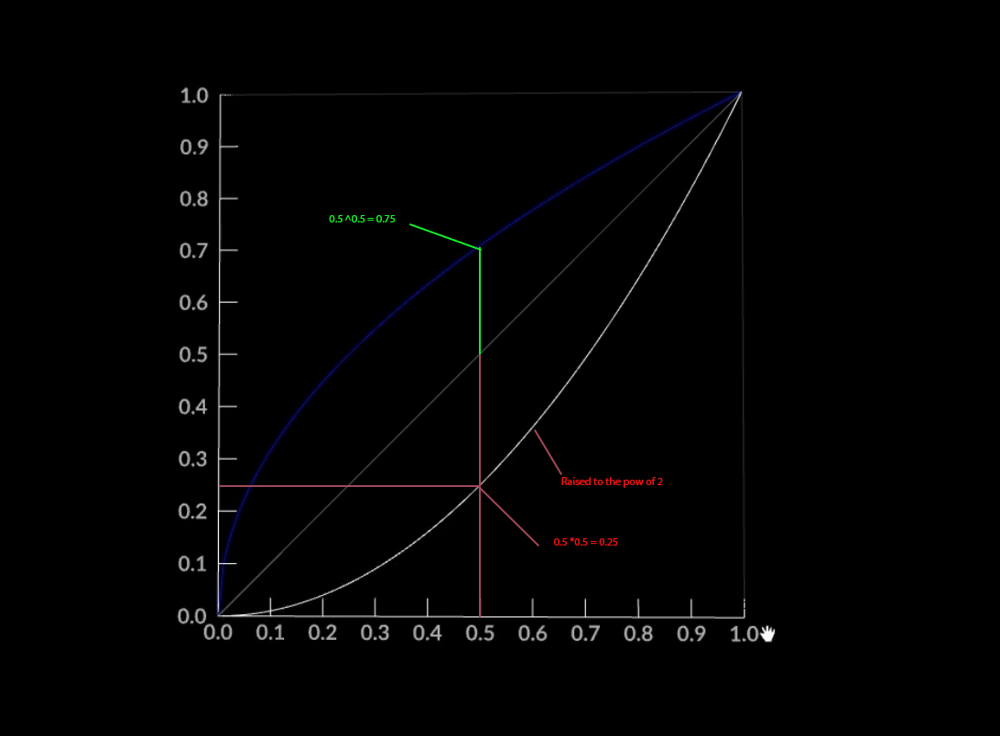

# MATH

basics

## Negate x*-1

addition   (order doesn't matter)
2+4=6

soustraction (order matters!)
2-4=-2

2+(-4) =-2   4*-(1) negate(mult by -1)

ex 
2* (-1) = -2
-2 * (-1) = 2 

ex:
when we want to subtract one vector from another,in order to control the order of the vector we instead add them together
and negate the one we want to be subtracted.

## Invert 1/x

Similar relationship than addition and substraction

Multiplication(order doesn't matter)
2*4=8

Division(order matters )
2/4 = 0.5

>- we can represent division in term of multiplication usiong the invert function

2*(0.125) = 0.5 
(1/4, invert) 1/x

# Power and Root

Power
2 ^ 3= 8

Root
3 squareroot of 8 = 2

same as 

8 ^ 0.33 = 2
1/3 invert

!!! note

    When we fix our colors (OETF, gamma) we essentialy multiply by 2.2.
    and when we want toreturnto linear color space, we multiply by the inverse 
    of 2.2 
