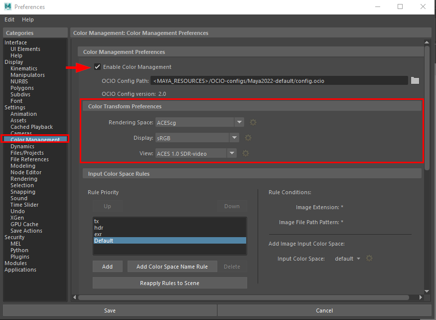
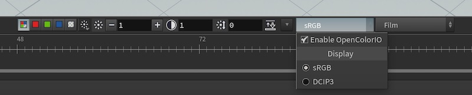

# OCIO

## ACES MAYA

The default settings for color management is ACES and the default rendering sapce is ACEScg.

You setup color color management in the maya preferences, windows> settings/preferences> preferences.

Color management in maya is based on OpenColorIO (OICO). OCIO use a configuration file, usually called "config.ocio" in yaml format. this file defines the color spaces and transforms that are available.
The same config file can be used by many creaction, compositing and editing software packages.

Maya contain two config, the default config for new scenes is based on ACES, the academy color encoding system.
The legacy config is used for compatibility in scenes from maya 2020 an earlier.

If your scene uses a specific cconfig file, you cans browse and select the instead.

## ACES HOUDINI

Computer programs like Houdini prefer to work in a linear color space internally, which is easy to manipulate digitally. It’s often preferable for outputs, such as final images, printed film, and displays, to be in perceptual color space (gamma corrected/color corrected). Color management in Houdini involves translating between linear and perceptual color spaces at the boundary between Houdini and the outside world at appropriate times.

OpenColorIO (OCIO) is an industry-standard open-source library for managing and translating color spaces.

OCIO is more powerful and flexible than Houdini’s default gamma and lookup table (LUT) support, and is recommended for professional use.

### Setup

- [x] Set the **$OCIO** environment variable to the file path of an OpenColorIO configuration file (such as config.ocio).
     The existence of this environment variable controls whether Houdini automatically uses OCIO in various places.

- [x] You can set the default colorspace using the OCIO_ACTIVE_DISPLAYS and OCIO_ACTIVE_VIEWS environment variables.

- [x] For sRGB files and sources, the source colorspace used for sRGB is defined by the Houdini environment variable          HOUDINI_OCIO_SRGB_FILE_COLORSPACE. If this variable is not defined, the OpenColorIO config file is searched for a colorspace      that matches srgb, either fully or partially.

- [x] You can turn various forms of OCIO support in the Edit ▸ Color Settings window.

!!!note 
    The OCIO, OCIO_ACTIVE_VIEWS, and OCIO_ACTIVE_DISPLAYS environment variables are not Houdini environment variables. They cannot be     set through the Aliases and Variables dialog, nor can they be set in the houdini.env file. They must be set in the shell or     desktop environment before launching Houdini.

### Image inputs
- [x] Texture images are assumed to be linear in Houdini and Mantra. If needed, you can manually convert textures using the OCIO Color Transform VOP.

- [x] If OCIO is configured and you set the File COP to linearize colors, it will use the OCIO file naming convention to deduce the color space of the input image and linearize it correctly. (This will also automatically switch the output to 16 bit to prevent banding.)

### Render output
- [x] Renders from Mantra are in linear space.

- [x] Flipbooks from the viewport are either sRGB or linear, depending on the “Render Beauty Pass Only” option (linear when On, sRGB when off).

- [x] The image in the Render View can be color corrected using OCIO.

- [x] The Correction toolbar is stowed by default at the bottom of the view. Click the stowbar just below the view area to show it. When OpenColorIO is active, Houdini replaces default gamma and LUT controls on the Correction toolbar with OCIO controls.

- [x] The output of the Render Region tool can be color corrected using OCIO. (You can turn this on or off in the Edit ▸ Color Settings window.)

### Color correcting the display
- [x] When OpenColorIO is active, the Scene View, Render View, and MPlay can use OCIO to color-correct display.

- [x] When OCIO is active, Houdini replaces default gamma and LUT controls on the Correction toolbar with OCIO controls.

>- In the Scene View, open the Viewport menu (the menu to the left of the Camera menu, in the top left corner of the viewport) and turn on Correction Toolbar to show the color correction toolbar at the bottom of the viewer.

>- In the Render View, the Correction toolbar is stowed by default at the bottom of the view. Click the stowbar just below the view area to show it.

- [x] When OpenColorIO is active ($OCIO points to a configuration file), gamma and LUT controls in the interface are replaced by Display and View menus. These define the output colorspace for the display. The colorspace within Houdini is linear, and the scene_linear role specifies the OpenColorIO linear colorspace.

- [x] For example, when OCIO is active, the scene viewer’s Color Correction toolbar (Viewport menu ▸ Correction Toolbar) has OCIO controls.

- [x] MPlay can load both linear and non-linear files, such as OpenEXR (linear) and JPEG (sRGB).

.........

## ACES 3DSMAX

Unfortunatly 3dsmax doesn't support OCIO

